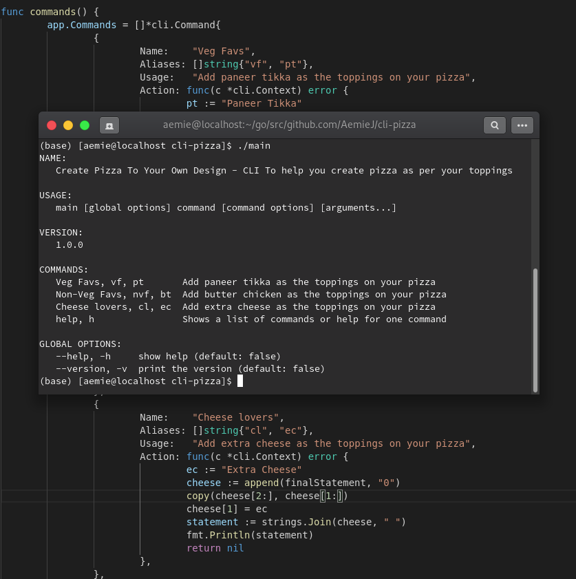

# MAKE YOUR PIZZA THROUGH CLI 

A simple CLI created using goland and urfave to let the user add their most favorite toppings on pizza to create a visual effect of their most favorite delicacy during the lockdown when getting pizza is too rare.

## Asthetic picture of how the CLI Looks

